# WhatsApp Clone (React Native + CometChat SDK)

This repository contains a WhatsApp-style chat application built with **React Native** and **CometChat SDK**.  
The project demonstrates how to build a production-ready chat system with messaging, calling, group management, and real-time updates.

---

## Features

- One-to-One and Group Chat (real time)
- Text Messages
- Media Messages (images, videos, audio, files)
- Group Action Messages (join, leave, kick, ban, delete)
- Call Action Messages
- Edit and Delete Messages (real time sync)
- Message Reactions
- Threaded Replies
- Pagination in Message List and Conversations
- Real-time Read Receipts (sent, delivered, read)
- Delete and Reset Conversation
- Typing Indicators
- Online/Offline User Status
- Automatic Conversation List Updates (new message moves chat to top)
- Unread Message Counts
- Audio and Video Calls for One-to-One conversations (default calls)
- Audio and Video Calls for Groups (direct calls)
- Group Details View
  - Admin: view members, add members, kick, ban, delete group
  - Participant: view members

_All features have been tested on physical devices after generating the APK._

---

## Prerequisites

- **Node.js** 18 or higher  
- **React Native** version 0.77 or later  

**iOS**  
- Xcode  
- CocoaPods  
- iOS device or simulator (iOS 12.0 or above)  

**Android**  
- Android Studio  
- Android device or emulator (Android 5.0 or above)  

---

## Getting Started

1. Clone the repository:
   ```bash
   git clone https://github.com/your-username/whatsapp-clone-cometchat.git
   cd whatsapp-clone-cometchat
   ```

2. Install dependencies:
   ```bash
   npm install
   # or
   yarn install
   ```

3. Register on the [CometChat Dashboard](https://app.cometchat.com/) and create a new app.

4. Copy the **App ID**, **Region**, and **Auth Key** generated for your app.

5. Update the credentials in `App.tsx`:
   ```typescript
   let appID = "YOUR_APP_ID";
   let region = "YOUR_REGION";
   const authKey = "YOUR_AUTH_KEY";
   ```

6. Run on iOS:
   ```bash
   cd ios
   pod install
   cd ..
   npm run ios
   ```

7. Run on Android:
   ```bash
   npm run android
   ```

---

## Screenshots

### Authentication Flow
| Login | Create Account |
|-------|----------------|
| 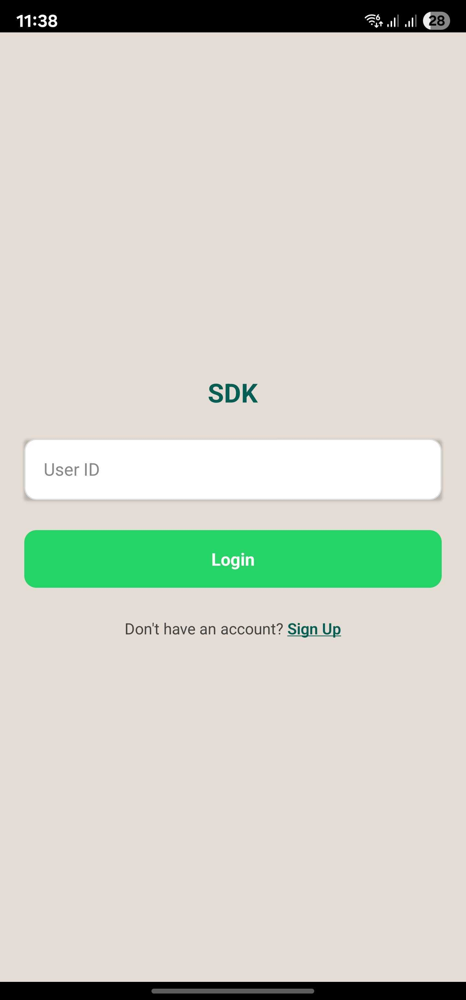 | 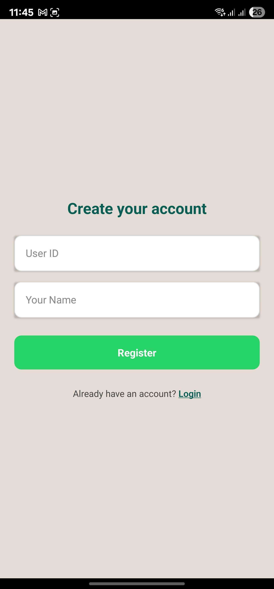 |

### Chat Interface
| Chat Screen | Chat Options | Users List |
|-------------|--------------|------------|
| 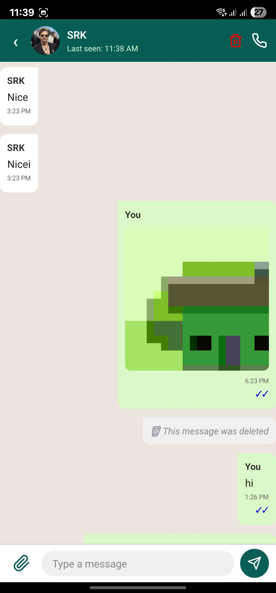 | 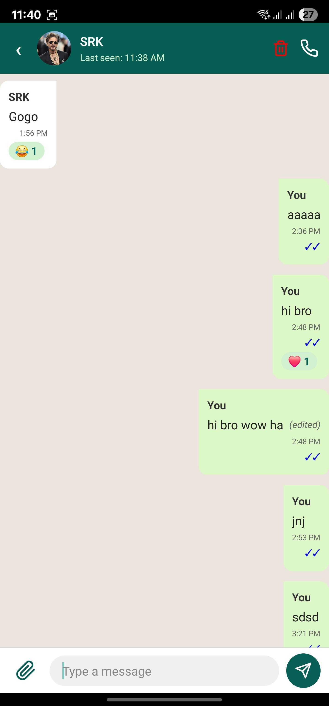 | 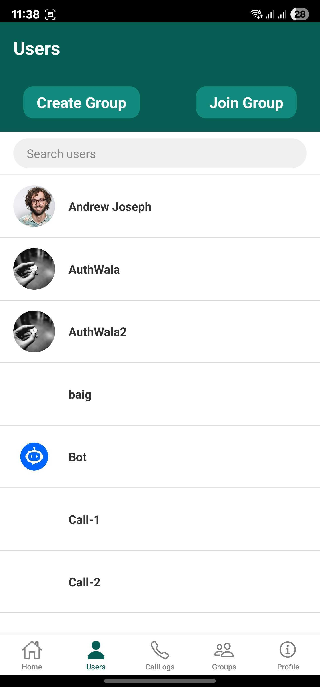 |

### Calling
| Incoming Call | Outgoing Call | Ongoing Call | Call Logs |
|---------------|---------------|--------------|-----------|
| 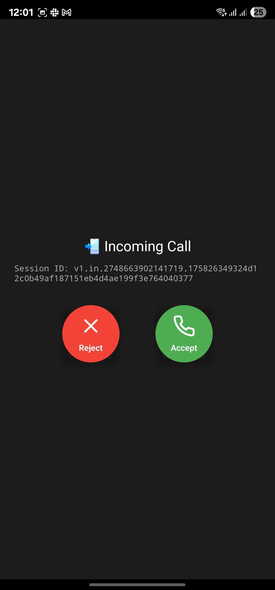 |  | 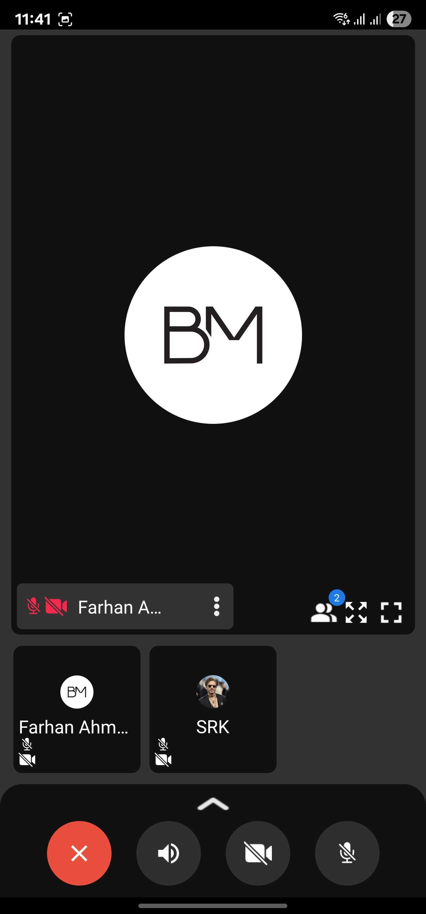 | 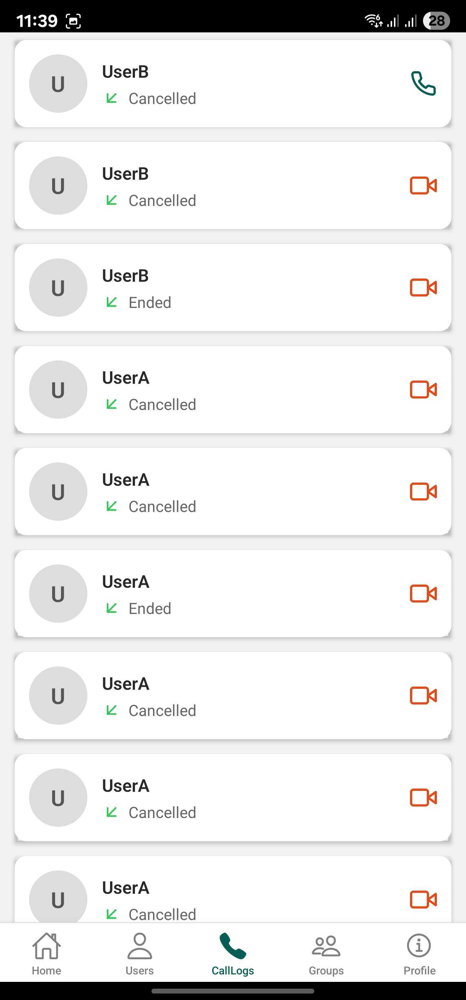 |

### Groups
| Create Group | Join Group | Group Members | Add Members | Banned Members |
|--------------|------------|----------------|-------------|----------------|
|  | 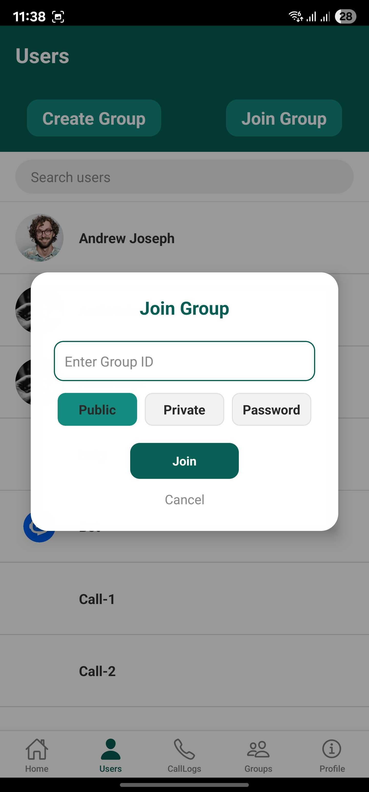 | 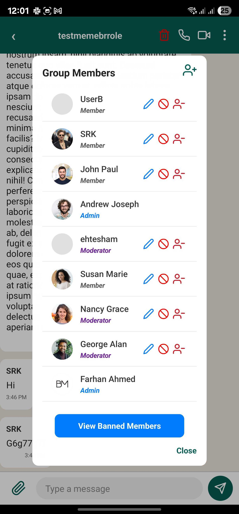 | 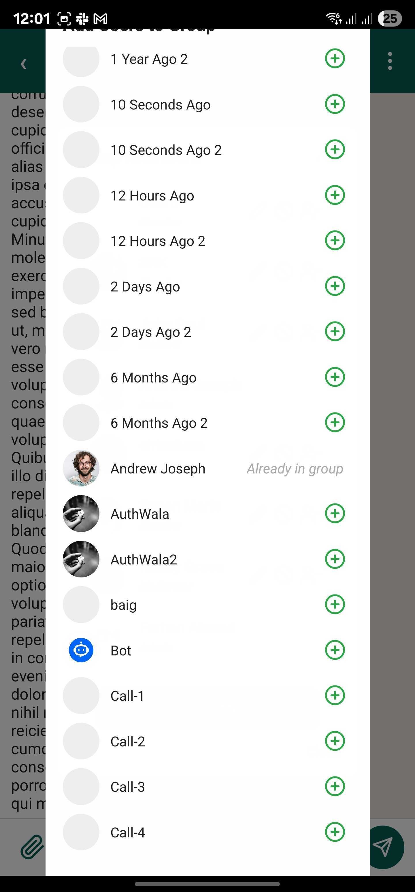 | 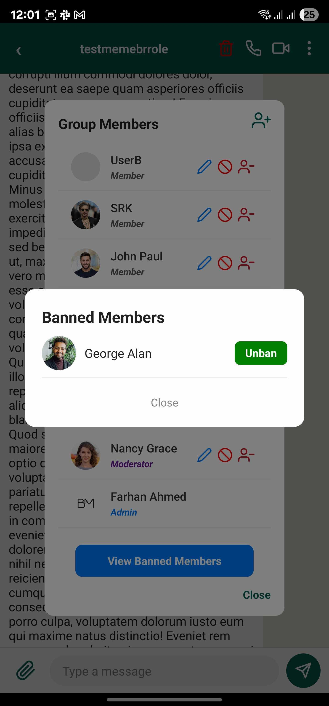 |

### Profile
| Profile |
|---------|
| 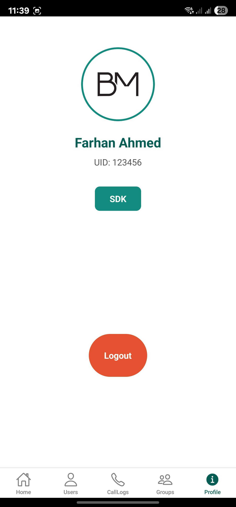 |

---

## Tech Stack

- React Native 0.77+
- CometChat SDK (Chat & Calling)
- Firebase Cloud Messaging (Push Notifications)
- Context API (Localization and State Management)
- Day.js (Date/Time Formatting)

---

## Notes

- This app is for demonstration and learning purposes.  
- It is not published on Play Store or App Store.  
- APKs can be built from source and tested directly on Android devices.  
