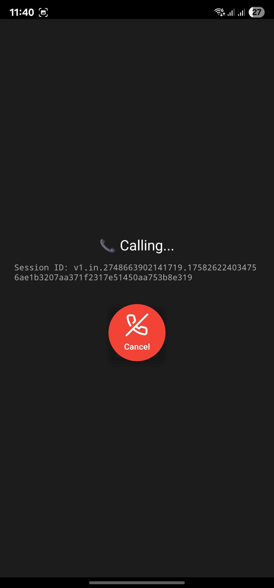
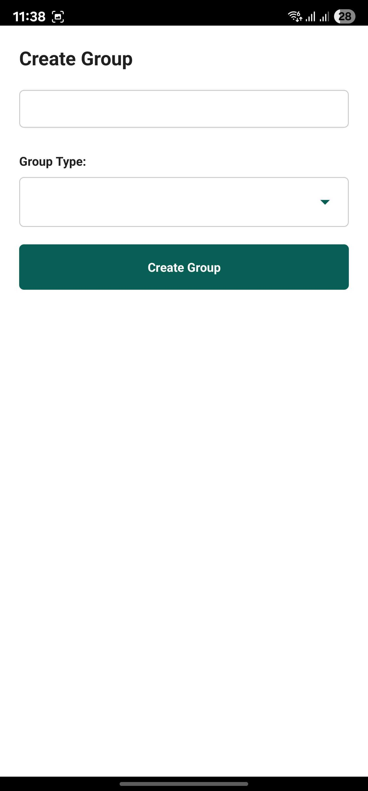

---

````markdown
# 📱 WhatsApp Clone (React Native + CometChat SDK)

A **WhatsApp-style chat application** built with **React Native** and **CometChat SDK**, featuring real-time chat, calling, reactions, threads, group management, and more.  

This project demonstrates how to build a **full-featured chat app** using CometChat’s SDK and UI components, customized to replicate WhatsApp-like functionality.

---

## 🚀 Features Implemented

✅ **1-on-1 & Group Chat** (real-time)  
✅ **Text Messages**  
✅ **Media Messages (images, videos, audio, files)**  
✅ **Group Action Messages** (join, leave, kick, ban, etc.)  
✅ **Call Action Messages**  
✅ **Edit & Delete Messages** (real-time sync)  
✅ **Message Reactions**  
✅ **Threaded Replies**  
✅ **Pagination** in Message List & Conversations  
✅ **Real-time Read Receipts** for 1-on-1 chats (Sent ✓, Delivered ✓✓, Read ✓✓ in blue)  
✅ **Delete / Reset Conversation**  
✅ **Typing Indicators** (real-time)  
✅ **Online/Offline User Status**  
✅ **Conversations List Auto-Update** (new messages move chat to top)  
✅ **Unread Message Counts**  
✅ **Default Calls** – Audio/Video 1-on-1  
✅ **Direct Calls** – Audio/Video for Groups  
✅ **Group Details View**  
   - 👑 If **Admin** → View/Add/Kick/Ban/Delete members, Delete group  
   - 👥 If **Participant** → View members only  

_All features tested successfully on 3 physical devices after APK build._

---

## 🛠️ Prerequisites

Before running the app, ensure you have the following:

### General
- [Node.js](https://nodejs.org/) **v18 or higher**
- [React Native](https://reactnative.dev/) **v0.77 or later**

### iOS
- Xcode  
- CocoaPods (`pod`)  
- iOS device/emulator with iOS **12.0+**

### Android
- Android Studio  
- Android device/emulator with Android **5.0+**

---

## ⚙️ Setup & Installation

### 1. Clone the Repository
```bash
git clone https://github.com/your-username/whatsapp-clone-cometchat.git
cd whatsapp-clone-cometchat
````

### 2. Install Dependencies

```bash
npm install
# OR
yarn install
```

### 3. Configure CometChat Credentials

1. Register on [CometChat Dashboard](https://app.cometchat.io/).

2. Create a **new app** inside your CometChat account.

3. Copy the following credentials:

   * **App ID**
   * **Region**
   * **Auth Key**

4. Open `App.tsx` and update the credentials:

```tsx
let appID = "YOUR_APP_ID";
let region = "YOUR_APP_REGION";
const authKey = "YOUR_AUTH_KEY";
```

### 4. Run on iOS

```bash
cd ios
pod install
cd ..
npm run ios
```

### 5. Run on Android

```bash
npm run android
```

---

## 📸 Features Showcase

## 🖼️ Screenshots

### 🔐 Authentication Flow
| Login | Create Account |
|-------|----------------|
|  |  |

---

### 💬 Chat Interface
| Chat Screen | Chat Options | Users List |
|-------------|--------------|------------|
|  |  |  |

---

### 📞 Calling
| Incoming Call | Outgoing Call | Ongoing Call | Call Logs |
|---------------|---------------|--------------|-----------|
|  |  |  |  |

---

### 👥 Groups
| Create Group | Join Group | Group Members | Add Members | Banned Members |
|--------------|------------|----------------|-------------|----------------|
|  |  |  |  |  |

---

### 🙍 Profile
| Profile |
|---------|
|  |


---

## 📦 Tech Stack

* **React Native** (v0.77)
* **CometChat SDK** (Chat + Calling)
* **Firebase (FCM)** – Push Notifications
* **Day.js** – Date/Time Formatting
* **Context API** – State & Localization
* **React Native Navigation**

---

## 📖 How to Use

1. Register/Login with a sample user (pre-created in your CometChat dashboard).
2. Start a 1-on-1 or group chat.
3. Try sending messages, media, reactions, editing/deleting, starting threads, and making calls.
4. If logged in as **Admin**, manage group members.

---

## 📌 Notes

* This app is **not published on Play Store/App Store**.
* To test:

  * Install via **APK (Android)** or
  * Run on **iOS/Android emulator** locally.
* APK builds can be found in the `release/` folder (if added).

---

## 📬 Contact

- [Portfolio](https://portfolio-farhan-ahmeds-projects-10079003.vercel.app)
- [GitHub](https://github.com/Farhan22798)
- [Email](mailto:mohdfarhan227@gmail.com)

---

````

---

